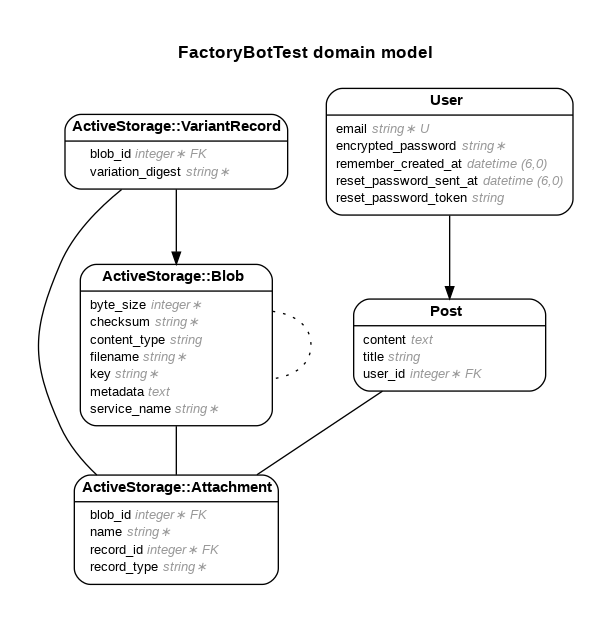

# README

Testing Active Storage and Devise using Factory Bot and RSpec

## Model

Generated by Rails ERD. Run rails erd to regenerate (must have graphviz).

## Versions

- ruby 3.2.2
- Rails 7.0.8

## Notes

- Sample Image: spec/assets/images/test.jpg
- attach the image in factories/post.rb
- Include in view specs if you want to use rails_blob_path:
  `include Rails.application.routes.url_helpers`
- Test if image is rendering using:
  `assert_select "img[src=?]", rails_blob_path(@post.image, only_path: true), count: 1`
- In spec/rails_helper.rb, add:
  `config.include Devise::Test::ControllerHelpers, type: :view`

## References

- https://www.youtube.com/watch?v=7JdyQEcZ7F8
